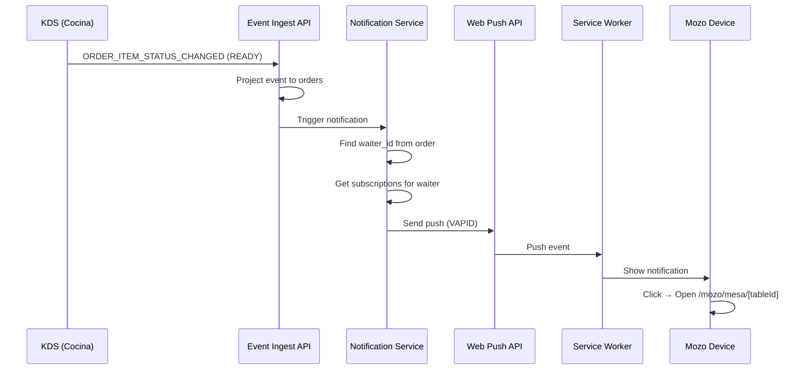
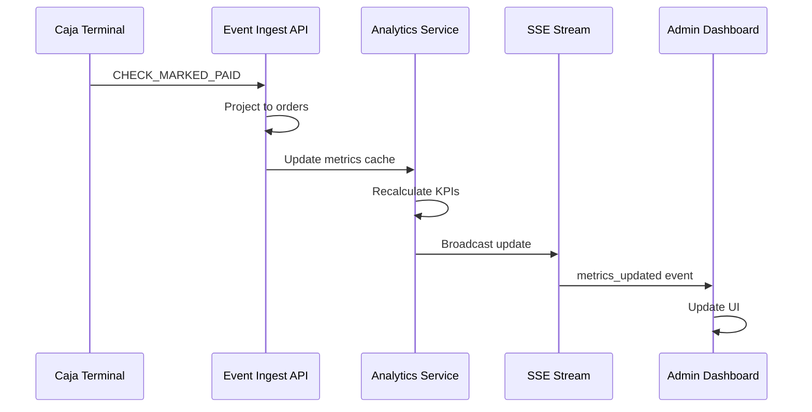

# Design Document: Premium Dashboard & Push Notifications

**Version:** 1.0  
**Date:** January 2026  
**Status:** Draft  
**Author:** PARK POS Team

---

## 1. Overview

Este documento describe el diseño técnico para implementar dos funcionalidades premium que diferencian PARK POS de la competencia:

1. **Dashboard de Analytics en Tiempo Real** - Panel con métricas del negocio actualizadas en tiempo real
2. **Notificaciones Push para Mozos** - Alertas instantáneas cuando items están listos o se solicita cuenta

### 1.1 Principios de Diseño

| Principio | Descripción |
|-----------|-------------|
| **Hot Path < 50ms** | Las métricas en tiempo real no deben bloquear operaciones críticas |
| **Event-Driven** | Métricas calculadas desde eventos existentes (Event Sourcing) |
| **Offline-First** | Notificaciones funcionan con Service Worker en background |
| **Zero Polling** | Usar SSE/WebSocket para actualizaciones, no polling |

### 1.2 Integración con Arquitectura Existente

```
┌─────────────────────────────────────────────────────────────────┐
│                        PARK POS Architecture                     │
├─────────────────────────────────────────────────────────────────┤
│                                                                  │
│  ┌──────────────┐    ┌──────────────┐    ┌──────────────┐       │
│  │   Terminal   │───▶│  Event Bus   │───▶│  Projector   │       │
│  │   (Mozo)     │    │   (SSE)      │    │  (Reducer)   │       │
│  └──────────────┘    └──────┬───────┘    └──────┬───────┘       │
│                             │                    │               │
│                             ▼                    ▼               │
│                    ┌──────────────┐    ┌──────────────┐         │
│                    │ Notification │    │  Analytics   │         │
│                    │   Service    │    │   Service    │         │
│                    └──────┬───────┘    └──────┬───────┘         │
│                           │                    │                 │
│                           ▼                    ▼                 │
│                    ┌──────────────┐    ┌──────────────┐         │
│                    │ Web Push API │    │  Dashboard   │         │
│                    │ (Background) │    │    (UI)      │         │
│                    └──────────────┘    └──────────────┘         │
│                                                                  │
└─────────────────────────────────────────────────────────────────┘
```

---

## 2. Architecture

### 2.1 Component Diagram

```mermaid
graph TB
    subgraph "Frontend Layer"
        DashboardUI[Dashboard UI<br>/admin/dashboard]
        MozoUI[Mozo UI<br>/mozo]
        CajaUI[Caja UI<br>/caja]
    end
    
    subgraph "Service Layer"
        AnalyticsService[Analytics Service<br>src/core/analytics/]
        NotificationService[Notification Service<br>src/core/notifications/]
    end
    
    subgraph "API Layer"
        RealtimeAPI[/api/admin/analytics/realtime]
        HistoryAPI[/api/admin/analytics/history]
        SubscribeAPI[/api/notifications/subscribe]
        SendAPI[/api/notifications/send]
    end
    
    subgraph "Data Layer"
        Events[(events)]
        Orders[(orders)]
        Subscriptions[(push_subscriptions)]
        Metrics[(analytics_cache)]
    end
    
    subgraph "External"
        WebPush[Web Push API<br>VAPID]
        ServiceWorker[Service Worker<br>sw.js]
    end
    
    DashboardUI --> RealtimeAPI
    DashboardUI --> HistoryAPI
    MozoUI --> SubscribeAPI
    CajaUI --> SubscribeAPI
    
    RealtimeAPI --> AnalyticsService
    HistoryAPI --> AnalyticsService
    SubscribeAPI --> NotificationService
    SendAPI --> NotificationService
    
    AnalyticsService --> Events
    AnalyticsService --> Orders
    AnalyticsService --> Metrics
    
    NotificationService --> Subscriptions
    NotificationService --> WebPush
    WebPush --> ServiceWorker
```

### 2.2 Sequence Diagram: Item Ready Notification



### 2.3 Sequence Diagram: Real-time Metrics Update



---

## 3. Components and Interfaces

### 3.1 Analytics Service

**Location:** `src/core/analytics/analytics.service.ts`

```typescript
/**
 * Analytics Service
 * Calcula métricas del negocio desde eventos y proyecciones
 * 
 * Principios:
 * - Métricas calculadas desde datos ya proyectados (no re-procesa eventos)
 * - Cache en memoria para hot path < 50ms
 * - Invalidación por eventos relevantes
 */

export interface RealtimeMetrics {
  // Ventas
  total_sales_cents: number;
  orders_count: number;
  avg_ticket_cents: number;
  sales_by_payment_method: Record<PaymentMethod, number>;
  
  // Mesas
  tables_occupied: number;
  tables_free: number;
  table_turnover: number;  // Rotación del turno
  
  // Tiempos
  avg_service_time_minutes: number;
  orders_per_hour: number;
  
  // Estaciones KDS
  stations: StationMetrics[];
  
  // Metadata
  shift_id: string;
  business_date: string;
  last_updated: string;
}

export interface StationMetrics {
  station: string;  // COCINA, HORNO, BAR
  avg_prep_time_minutes: number;
  pending_items: number;
  oldest_item_minutes: number | null;
  has_alert: boolean;  // > 10 items pendientes
}

export interface ComparisonMetrics {
  current: RealtimeMetrics;
  previous: RealtimeMetrics;  // Mismo día semana anterior
  delta_percent: {
    total_sales: number;
    orders_count: number;
    avg_ticket: number;
  };
}

export interface TopProduct {
  product_id: string;
  sku: string;
  name: string;
  qty_sold: number;
  revenue_cents: number;
}

export interface AnalyticsService {
  // Real-time (hot path)
  getRealtimeMetrics(tenantId: string, shiftId?: string): Promise<RealtimeMetrics>;
  getStationMetrics(tenantId: string): Promise<StationMetrics[]>;
  getTopProducts(tenantId: string, limit?: number): Promise<TopProduct[]>;
  
  // Historical (cold path)
  getHistoricalMetrics(tenantId: string, from: Date, to: Date): Promise<RealtimeMetrics[]>;
  getComparison(tenantId: string): Promise<ComparisonMetrics>;
  
  // Cache management
  invalidateCache(tenantId: string): void;
  warmCache(tenantId: string): Promise<void>;
}
```

### 3.2 Notification Service

**Location:** `src/core/notifications/notification.service.ts`

```typescript
/**
 * Notification Service
 * Gestiona suscripciones Web Push y envío de notificaciones
 * 
 * Principios:
 * - Fail silently si no hay suscripción
 * - Agrupa notificaciones múltiples
 * - Respeta preferencias del usuario
 */

export interface PushSubscription {
  id: string;
  tenant_id: string;
  employee_id: string;
  endpoint: string;
  keys: {
    p256dh: string;
    auth: string;
  };
  device_info?: string;
  created_at: string;
  last_used_at: string;
}

export interface NotificationPreferences {
  employee_id: string;
  items_ready: boolean;
  request_check: boolean;
  sound_enabled: boolean;
}

export interface NotificationPayload {
  type: 'ITEM_READY' | 'REQUEST_CHECK' | 'TEST';
  title: string;
  body: string;
  icon?: string;
  badge?: string;
  data: {
    order_id: string;
    table_number?: string;
    station?: string;
    url?: string;  // Deep link
  };
  tag?: string;  // Para agrupar
}

export interface NotificationService {
  // Subscriptions
  subscribe(tenantId: string, employeeId: string, subscription: PushSubscriptionJSON): Promise<void>;
  unsubscribe(tenantId: string, employeeId: string, endpoint: string): Promise<void>;
  getSubscriptions(tenantId: string, employeeId: string): Promise<PushSubscription[]>;
  
  // Preferences
  getPreferences(tenantId: string, employeeId: string): Promise<NotificationPreferences>;
  updatePreferences(tenantId: string, employeeId: string, prefs: Partial<NotificationPreferences>): Promise<void>;
  
  // Sending
  sendToEmployee(tenantId: string, employeeId: string, payload: NotificationPayload): Promise<void>;
  sendToRole(tenantId: string, role: string, payload: NotificationPayload): Promise<void>;
  sendTest(tenantId: string, employeeId: string): Promise<void>;
  
  // Admin
  getSubscriptionStatus(tenantId: string): Promise<EmployeeSubscriptionStatus[]>;
}

export interface EmployeeSubscriptionStatus {
  employee_id: string;
  employee_name: string;
  has_subscription: boolean;
  last_active: string | null;
  days_inactive: number;
}
```

### 3.3 Event Handlers

**Location:** `src/core/notifications/event-handlers.ts`

```typescript
/**
 * Event Handlers para Notificaciones
 * Se registran en el Event Bus para reaccionar a eventos relevantes
 */

export interface NotificationEventHandlers {
  // Cuando un item cambia a READY
  handleItemReady(event: OrderItemStatusChangedEvent): Promise<void>;
  
  // Cuando se solicita cuenta
  handleRequestCheck(event: RequestCheckEvent): Promise<void>;
  
  // Cuando se completa una venta (para analytics)
  handleCheckPaid(event: CheckMarkedPaidEvent): Promise<void>;
}
```

---

## 4. Data Models

### 4.1 New Database Tables

```sql
-- Push Subscriptions (Web Push API)
CREATE TABLE push_subscriptions (
    id UUID PRIMARY KEY DEFAULT gen_random_uuid(),
    tenant_id UUID NOT NULL,
    employee_id UUID NOT NULL,
    endpoint TEXT NOT NULL,
    p256dh_key TEXT NOT NULL,
    auth_key TEXT NOT NULL,
    device_info TEXT,
    created_at TIMESTAMPTZ DEFAULT NOW(),
    last_used_at TIMESTAMPTZ DEFAULT NOW(),
    
    UNIQUE(tenant_id, employee_id, endpoint)
);

CREATE INDEX idx_push_subs_employee ON push_subscriptions(tenant_id, employee_id);

-- Notification Preferences
CREATE TABLE notification_preferences (
    tenant_id UUID NOT NULL,
    employee_id UUID NOT NULL,
    items_ready BOOLEAN DEFAULT TRUE,
    request_check BOOLEAN DEFAULT TRUE,
    sound_enabled BOOLEAN DEFAULT TRUE,
    updated_at TIMESTAMPTZ DEFAULT NOW(),
    
    PRIMARY KEY(tenant_id, employee_id)
);

-- Analytics Cache (opcional, para métricas pre-calculadas)
CREATE TABLE analytics_cache (
    tenant_id UUID NOT NULL,
    cache_key TEXT NOT NULL,  -- 'realtime', 'shift:{id}', 'date:{YYYY-MM-DD}'
    metrics JSONB NOT NULL,
    computed_at TIMESTAMPTZ DEFAULT NOW(),
    expires_at TIMESTAMPTZ,
    
    PRIMARY KEY(tenant_id, cache_key)
);

CREATE INDEX idx_analytics_cache_expiry ON analytics_cache(expires_at);
```

### 4.2 Prisma Schema Additions

```prisma
model push_subscriptions {
  id          String   @id @db.Uuid @default(dbgenerated("gen_random_uuid()"))
  tenant_id   String   @db.Uuid
  employee_id String   @db.Uuid
  endpoint    String
  p256dh_key  String
  auth_key    String
  device_info String?
  created_at  DateTime @default(now()) @db.Timestamptz(6)
  last_used_at DateTime @default(now()) @db.Timestamptz(6)
  
  employees   employees @relation(fields: [employee_id], references: [id])
  
  @@unique([tenant_id, employee_id, endpoint])
  @@index([tenant_id, employee_id])
}

model notification_preferences {
  tenant_id     String   @db.Uuid
  employee_id   String   @db.Uuid
  items_ready   Boolean  @default(true)
  request_check Boolean  @default(true)
  sound_enabled Boolean  @default(true)
  updated_at    DateTime @default(now()) @db.Timestamptz(6)
  
  employees     employees @relation(fields: [employee_id], references: [id])
  
  @@id([tenant_id, employee_id])
}

model analytics_cache {
  tenant_id   String   @db.Uuid
  cache_key   String
  metrics     Json
  computed_at DateTime @default(now()) @db.Timestamptz(6)
  expires_at  DateTime? @db.Timestamptz(6)
  
  @@id([tenant_id, cache_key])
  @@index([expires_at])
}
```

### 4.3 TypeScript Types

```typescript
// src/core/notifications/types.ts

export type NotificationType = 'ITEM_READY' | 'REQUEST_CHECK' | 'TEST';

export interface WebPushKeys {
  p256dh: string;
  auth: string;
}

export interface PushSubscriptionData {
  endpoint: string;
  keys: WebPushKeys;
  expirationTime?: number | null;
}

// src/core/analytics/types.ts

export type PaymentMethod = 'CASH' | 'YAPE' | 'PLIN' | 'CARD' | 'TRANSFER';

export interface HourlySales {
  hour: number;  // 0-23
  sales_cents: number;
  orders_count: number;
}

export interface DateRangeFilter {
  from: string;  // YYYY-MM-DD
  to: string;    // YYYY-MM-DD
}
```

---

## 5. API Endpoints

### 5.1 Analytics API

```typescript
// GET /api/admin/analytics/realtime
// Returns: RealtimeMetrics
// Auth: ADMIN, OWNER
// Response time: < 200ms

// GET /api/admin/analytics/history?from=YYYY-MM-DD&to=YYYY-MM-DD
// Returns: RealtimeMetrics[]
// Auth: ADMIN, OWNER

// GET /api/admin/analytics/comparison
// Returns: ComparisonMetrics
// Auth: ADMIN, OWNER

// GET /api/admin/analytics/top-products?limit=5
// Returns: TopProduct[]
// Auth: ADMIN, OWNER

// GET /api/admin/analytics/hourly
// Returns: HourlySales[]
// Auth: ADMIN, OWNER
```

### 5.2 Notifications API

```typescript
// POST /api/notifications/subscribe
// Body: { subscription: PushSubscriptionJSON }
// Auth: Any authenticated employee
// Returns: { success: true }

// DELETE /api/notifications/subscribe
// Body: { endpoint: string }
// Auth: Any authenticated employee
// Returns: { success: true }

// GET /api/notifications/preferences
// Auth: Any authenticated employee
// Returns: NotificationPreferences

// PATCH /api/notifications/preferences
// Body: Partial<NotificationPreferences>
// Auth: Any authenticated employee
// Returns: NotificationPreferences

// POST /api/notifications/test
// Auth: ADMIN (para enviar a otros), Any (para auto-test)
// Body: { employee_id?: string }
// Returns: { success: true }

// GET /api/admin/notifications/status
// Auth: ADMIN, OWNER
// Returns: EmployeeSubscriptionStatus[]
```

---

## 6. Service Worker Integration

### 6.1 Push Event Handler

```javascript
// Additions to public/sw.js

self.addEventListener('push', function(event) {
  if (!event.data) return;
  
  const payload = event.data.json();
  
  const options = {
    body: payload.body,
    icon: payload.icon || '/logo.svg',
    badge: '/images/badge-72x72.png',
    tag: payload.tag || payload.type,
    data: payload.data,
    vibrate: [200, 100, 200],
    actions: getActionsForType(payload.type),
    requireInteraction: payload.type === 'REQUEST_CHECK',
  };
  
  event.waitUntil(
    self.registration.showNotification(payload.title, options)
  );
});

self.addEventListener('notificationclick', function(event) {
  event.notification.close();
  
  const data = event.notification.data;
  const url = data?.url || '/mozo';
  
  event.waitUntil(
    clients.matchAll({ type: 'window' }).then(windowClients => {
      // Si ya hay una ventana abierta, navegar a ella
      for (const client of windowClients) {
        if (client.url.includes('/mozo') && 'focus' in client) {
          client.navigate(url);
          return client.focus();
        }
      }
      // Si no, abrir nueva ventana
      return clients.openWindow(url);
    })
  );
});

function getActionsForType(type) {
  switch (type) {
    case 'ITEM_READY':
      return [
        { action: 'view', title: 'Ver Mesa' },
        { action: 'dismiss', title: 'Cerrar' }
      ];
    case 'REQUEST_CHECK':
      return [
        { action: 'view', title: 'Abrir Cuenta' },
        { action: 'dismiss', title: 'Cerrar' }
      ];
    default:
      return [];
  }
}
```

### 6.2 VAPID Configuration

```typescript
// Environment variables required:
// VAPID_PUBLIC_KEY - Public key for Web Push
// VAPID_PRIVATE_KEY - Private key for Web Push
// VAPID_SUBJECT - mailto: or https:// URL

// Generate keys with: npx web-push generate-vapid-keys
```

---

## 7. Correctness Properties

*A property is a characteristic or behavior that should hold true across all valid executions of a system—essentially, a formal statement about what the system should do. Properties serve as the bridge between human-readable specifications and machine-verifiable correctness guarantees.*


### 7.1 Analytics Properties

**Property 1: Metrics Calculation Correctness**

*For any* set of completed orders in a shift, the calculated metrics SHALL satisfy:
- `total_sales_cents` = SUM of all `total_cents` from paid checks
- `orders_count` = COUNT of distinct orders with at least one paid check
- `avg_ticket_cents` = `total_sales_cents` / `orders_count` (rounded)
- `sales_by_payment_method[method]` = SUM of payments by that method

**Validates: Requirements 1.3, 1.4, 1.5, 1.7**

---

**Property 2: Date Filtering Correctness**

*For any* date range filter [from, to] and set of orders, the filtered metrics SHALL include only orders where `business_date >= from AND business_date <= to`.

**Validates: Requirements 1.6, 10.2**

---

**Property 3: Comparison Calculation Correctness**

*For any* current business date D, the comparison metrics SHALL:
- Compare with date D-7 (same day of week, previous week)
- `delta_percent.total_sales` = ((current - previous) / previous) * 100
- Positive delta when current > previous, negative when current < previous

**Validates: Requirements 2.1, 2.2, 2.3**

---

**Property 4: Top Products Ranking**

*For any* set of order items in a shift, `getTopProducts(limit=N)` SHALL return exactly N products (or all if fewer exist) sorted by `qty_sold` descending, with ties broken by `revenue_cents` descending.

**Validates: Requirements 2.4**

---

**Property 5: Station Metrics Correctness**

*For any* set of order items with station assignments:
- `pending_items` = COUNT of items WHERE status IN ('PENDING', 'COOKING')
- `avg_prep_time_minutes` = AVG(ready_at - started_cooking_at) for completed items
- `has_alert` = TRUE if and only if `pending_items > 10`
- `oldest_item_minutes` = MAX(now - created_at) for pending items

**Validates: Requirements 3.1, 3.2, 3.3, 3.4**

---

### 7.2 Notification Properties

**Property 6: Subscription Storage Integrity**

*For any* valid push subscription data and employee_id:
- After `subscribe()`, `getSubscriptions(employee_id)` SHALL include the subscription
- Multiple subscriptions per employee SHALL be allowed (different endpoints)
- After `unsubscribe(endpoint)`, that endpoint SHALL NOT appear in subscriptions

**Validates: Requirements 4.2, 4.3, 4.5**

---

**Property 7: Notification Routing Correctness**

*For any* ORDER_ITEM_STATUS_CHANGED event with `to: 'READY'`:
- The notification SHALL be sent to the `waiter_id` of the order
- The notification SHALL NOT be sent to other employees

*For any* REQUEST_CHECK event:
- The notification SHALL be sent to all employees with role 'CASHIER'
- The notification SHALL NOT be sent to non-CASHIER roles

**Validates: Requirements 5.1, 6.1**

---

**Property 8: Notification Payload Completeness**

*For any* ITEM_READY notification, the payload SHALL contain:
- `table_number` (from order.fulfillment)
- `item_name` (from the item)
- `station` (from the item)
- `url` matching pattern `/mozo/mesa/{tableId}`

*For any* REQUEST_CHECK notification, the payload SHALL contain:
- `table_number`
- `total_cents` (from order)
- `waiter_name` (from employee)
- `url` matching pattern `/caja/orden/{orderId}`

**Validates: Requirements 5.2, 5.4, 6.2, 6.3**

---

**Property 9: Notification Grouping**

*For any* sequence of ITEM_READY events for the same order within 5 seconds, the system SHALL send at most ONE notification containing all ready items.

**Validates: Requirements 5.3**

---

**Property 10: Graceful Failure on Missing Subscription**

*For any* notification send attempt to an employee without active subscriptions:
- The operation SHALL complete without throwing an error
- No notification SHALL be sent
- The system SHALL log the skip (for debugging)

**Validates: Requirements 5.5**

---

**Property 11: Preference Respect**

*For any* notification send attempt:
- IF `preferences.items_ready = false` AND type = 'ITEM_READY', THEN no notification SHALL be sent
- IF `preferences.request_check = false` AND type = 'REQUEST_CHECK', THEN no notification SHALL be sent

**Validates: Requirements 9.1, 9.2**

---

### 7.3 API Properties

**Property 12: API Authorization**

*For any* request to `/api/admin/analytics/*`:
- IF actor role NOT IN ('ADMIN', 'OWNER'), THEN response SHALL be 403 Forbidden
- IF actor role IN ('ADMIN', 'OWNER'), THEN response SHALL be 200 OK with data

**Validates: Requirements 10.3**

---

**Property 13: API Response Time**

*For any* request to `/api/admin/analytics/realtime`:
- Response time SHALL be less than 200ms (p95)
- Response SHALL be valid JSON matching RealtimeMetrics schema

**Validates: Requirements 10.4, 10.5**

---

## 8. Error Handling

### 8.1 Analytics Service Errors

| Error Scenario | Handling | User Impact |
|----------------|----------|-------------|
| Database unavailable | Return cached metrics with stale indicator | Dashboard shows "Datos de hace X minutos" |
| No shift open | Return last closed shift metrics | Dashboard shows "Último turno cerrado" |
| Calculation overflow | Cap at MAX_SAFE_INTEGER | Unlikely in practice |
| Invalid date range | Return 400 Bad Request | Form validation prevents |

### 8.2 Notification Service Errors

| Error Scenario | Handling | User Impact |
|----------------|----------|-------------|
| Push endpoint expired | Remove subscription, log | Employee must re-subscribe |
| Web Push API error | Retry 3x with backoff, then skip | Notification may be delayed/lost |
| Invalid subscription data | Reject with 400 | Subscription form shows error |
| Employee not found | Skip silently, log | No notification sent |
| Rate limit exceeded | Queue for later | Slight delay |

### 8.3 Error Codes

```typescript
export enum AnalyticsErrorCode {
  SHIFT_NOT_FOUND = 'ANALYTICS_001',
  INVALID_DATE_RANGE = 'ANALYTICS_002',
  CACHE_STALE = 'ANALYTICS_003',
  CALCULATION_ERROR = 'ANALYTICS_004',
}

export enum NotificationErrorCode {
  SUBSCRIPTION_EXPIRED = 'NOTIF_001',
  PUSH_FAILED = 'NOTIF_002',
  EMPLOYEE_NOT_FOUND = 'NOTIF_003',
  INVALID_PAYLOAD = 'NOTIF_004',
  PREFERENCE_BLOCKED = 'NOTIF_005',
}
```

---

## 9. Testing Strategy

### 9.1 Unit Tests

| Component | Test Focus | Framework |
|-----------|------------|-----------|
| AnalyticsService | Metric calculations, edge cases | Vitest |
| NotificationService | Subscription CRUD, payload building | Vitest |
| Event Handlers | Correct routing, payload extraction | Vitest |
| API Routes | Auth, validation, response shape | Vitest |

### 9.2 Property-Based Tests

| Property | Generator Strategy | Library |
|----------|-------------------|---------|
| Metrics Calculation | Random orders with payments | fast-check |
| Date Filtering | Random date ranges, orders | fast-check |
| Top Products | Random items with quantities | fast-check |
| Station Metrics | Random items with timestamps | fast-check |
| Notification Routing | Random events, employee roles | fast-check |
| Payload Completeness | Random order/item data | fast-check |

**Configuration:**
- Minimum 100 iterations per property test
- Shrinking enabled for counterexample minimization
- Seed logging for reproducibility

### 9.3 Integration Tests

| Scenario | Components | Approach |
|----------|------------|----------|
| End-to-end notification | Event → Service → Push | Mock Web Push API |
| Dashboard data flow | API → Service → DB | Test database |
| SSE updates | Event → Broadcast → Client | WebSocket mock |

### 9.4 Performance Tests

| Metric | Target | Test Method |
|--------|--------|-------------|
| Realtime API latency | < 200ms p95 | Load test with k6 |
| Metrics calculation | < 50ms | Benchmark with large dataset |
| Notification send | < 100ms | Measure push API call |

---

## 10. Security Considerations

### 10.1 Web Push Security

- **VAPID Keys**: Stored in environment variables, never in code
- **Subscription Validation**: Verify endpoint domain matches expected push service
- **Payload Encryption**: Web Push API handles encryption automatically
- **No Sensitive Data**: Notifications contain minimal info (table number, item name)

### 10.2 API Security

- **Authentication**: All analytics APIs require valid session
- **Authorization**: Role-based access (ADMIN, OWNER only)
- **Rate Limiting**: 100 requests/minute per tenant
- **Input Validation**: Zod schemas for all inputs

### 10.3 Data Privacy

- **Subscription Data**: Encrypted at rest in database
- **Employee Tracking**: Only subscription status visible to admin, not content
- **Notification Content**: No PII in push payloads

---

## 11. Deployment Considerations

### 11.1 Environment Variables

```bash
# Web Push (VAPID)
VAPID_PUBLIC_KEY=BEl62iUYgU...
VAPID_PRIVATE_KEY=secret...
VAPID_SUBJECT=mailto:admin@parkpos.pe

# Feature Flags
ENABLE_PUSH_NOTIFICATIONS=true
ENABLE_REALTIME_ANALYTICS=true

# Performance
ANALYTICS_CACHE_TTL_SECONDS=30
NOTIFICATION_BATCH_WINDOW_MS=5000
```

### 11.2 Database Migrations

```bash
# Run migrations for new tables
npx prisma migrate dev --name add_push_subscriptions
npx prisma migrate dev --name add_notification_preferences
npx prisma migrate dev --name add_analytics_cache
```

### 11.3 Service Worker Update

The existing Service Worker (`public/sw.js`) needs to be extended with push event handlers. This is a breaking change that requires:

1. Increment SW version
2. Users will be prompted to refresh
3. New subscriptions will be created on refresh

---

## 12. Future Enhancements

### 12.1 Phase 2 Considerations

- **WebSocket for Dashboard**: Replace SSE with WebSocket for bidirectional communication
- **Notification History**: Store sent notifications for audit trail
- **Custom Alerts**: Admin-defined thresholds for KPIs
- **Export to Excel**: Download metrics as spreadsheet

### 12.2 Scalability

- **Redis Cache**: Move analytics cache to Redis for multi-instance deployment
- **Push Queue**: Use message queue (SQS/Redis) for notification delivery
- **Materialized Views**: Pre-compute daily summaries for historical queries

---

**End of Design Document v1.0**
