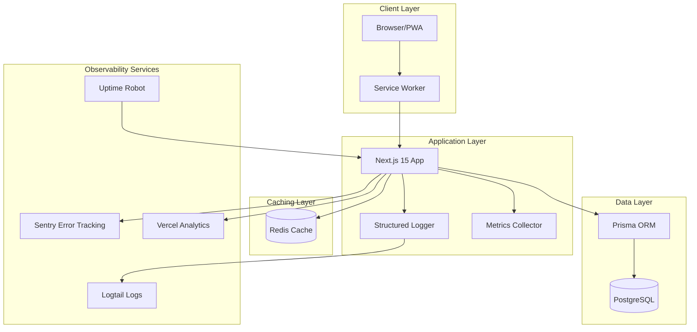
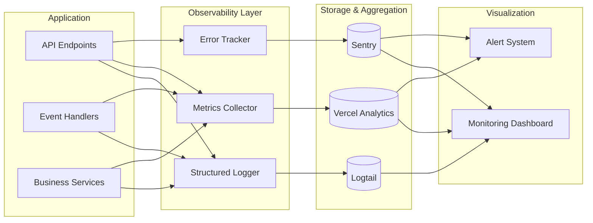
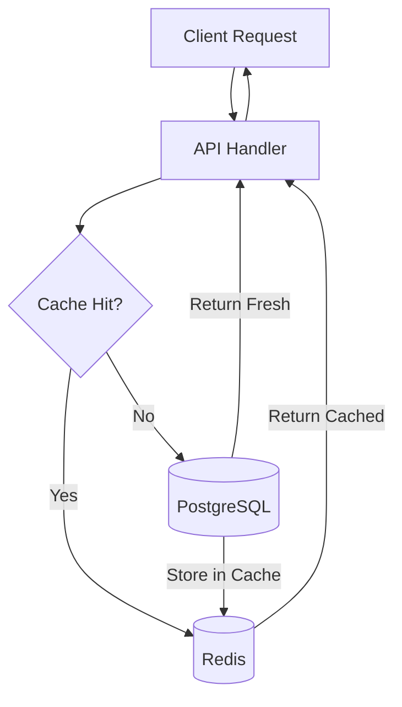

# Design Document - System Consolidation Phase 1

## Overview

This design document outlines the technical implementation for Phase 1 of the PARK POS system consolidation. The system is currently in production with a solid Event Sourcing architecture, offline-first capabilities, and multi-tenant support. However, it lacks comprehensive observability, API documentation, and performance optimization needed for production-grade reliability.

The consolidation focuses on three pillars:

1. **Observability Infrastructure** - Structured logging, error tracking, metrics collection, and monitoring
2. **Developer Experience** - API documentation, code documentation, and testing tools
3. **Performance Optimization** - Caching, query optimization, code splitting, and performance budgets

### Design Goals

- **Zero Downtime**: All changes must be backward compatible and deployable without service interruption
- **Free Tier First**: Prioritize free tiers of third-party services (Sentry, Uptime Robot, Logtail)
- **Minimal Dependencies**: Add only essential libraries to keep bundle size small
- **Type Safety**: Maintain strong TypeScript typing throughout
- **Testability**: All components must be unit testable and property testable

### Non-Goals

- Rewriting existing functionality
- Changing the Event Sourcing architecture
- Modifying the offline-first sync mechanism
- Adding new business features

## Architecture

### High-Level Architecture



### Observability Architecture

The observability system follows the three pillars of observability: logs, metrics, and traces.



### Caching Architecture

The caching layer uses Redis to reduce database load and improve response times.



**Cache Strategy:**
- **Cache-Aside Pattern**: Application checks cache first, then database
- **TTL-Based Expiration**: Different TTLs for different data types
- **Cache Invalidation**: Explicit invalidation on data updates
- **Graceful Degradation**: Fall back to database if Redis is unavailable

## Components and Interfaces

### 1. Structured Logger

**Purpose**: Provide consistent, searchable logging across the application.

**Interface:**

```typescript
// src/core/observability/logger.ts

export interface LogContext {
  tenantId?: string;
  terminalId?: string;
  userId?: string;
  correlationId?: string;
  [key: string]: unknown;
}

export interface Logger {
  debug(message: string, context?: LogContext): void;
  info(message: string, context?: LogContext): void;
  warn(message: string, context?: LogContext): void;
  error(message: string, error: Error, context?: LogContext): void;
  fatal(message: string, error: Error, context?: LogContext): void;
}

export class StructuredLogger implements Logger {
  private serviceName: string;
  private environment: string;
  
  constructor(serviceName: string) {
    this.serviceName = serviceName;
    this.environment = process.env.NODE_ENV || 'development';
  }
  
  debug(message: string, context?: LogContext): void {
    this.log('DEBUG', message, context);
  }
  
  info(message: string, context?: LogContext): void {
    this.log('INFO', message, context);
  }
  
  warn(message: string, context?: LogContext): void {
    this.log('WARN', message, context);
  }
  
  error(message: string, error: Error, context?: LogContext): void {
    this.log('ERROR', message, {
      ...context,
      error: {
        name: error.name,
        message: error.message,
        stack: error.stack,
      },
    });
  }
  
  fatal(message: string, error: Error, context?: LogContext): void {
    this.log('FATAL', message, {
      ...context,
      error: {
        name: error.name,
        message: error.message,
        stack: error.stack,
      },
    });
  }
  
  private log(level: string, message: string, context?: LogContext): void {
    const logEntry = {
      timestamp: new Date().toISOString(),
      level,
      service: this.serviceName,
      environment: this.environment,
      message,
      ...context,
    };
    
    // In production, send to Logtail
    if (this.environment === 'production') {
      this.sendToLogtail(logEntry);
    }
    
    // Always log to console for local development
    console.log(JSON.stringify(logEntry));
  }
  
  private sendToLogtail(logEntry: unknown): void {
    // Implementation will use Logtail SDK
  }
}

// Singleton instance
export const logger = new StructuredLogger('park-pos');
```

**Usage Example:**

```typescript
import { logger } from '@/core/observability/logger';

export async function createOrder(data: CreateOrderInput) {
  logger.info('Creating order', {
    tenantId: data.tenantId,
    terminalId: data.terminalId,
    itemCount: data.items.length,
  });
  
  try {
    const order = await prisma.order.create({ data });
    
    logger.info('Order created successfully', {
      tenantId: data.tenantId,
      orderId: order.id,
      total: order.total,
    });
    
    return order;
  } catch (error) {
    logger.error('Failed to create order', error as Error, {
      tenantId: data.tenantId,
      terminalId: data.terminalId,
    });
    throw error;
  }
}
```

### 2. Metrics Collector

**Purpose**: Track business and technical metrics for monitoring and analytics.

**Interface:**

```typescript
// src/core/observability/metrics.ts

export interface MetricTags {
  tenantId?: string;
  terminalId?: string;
  eventType?: string;
  endpoint?: string;
  [key: string]: string | undefined;
}

export interface MetricsCollector {
  increment(metric: string, tags?: MetricTags): void;
  decrement(metric: string, tags?: MetricTags): void;
  gauge(metric: string, value: number, tags?: MetricTags): void;
  histogram(metric: string, value: number, tags?: MetricTags): void;
  timing(metric: string, duration: number, tags?: MetricTags): void;
}

export class VercelMetricsCollector implements MetricsCollector {
  private metrics: Map<string, number> = new Map();
  
  increment(metric: string, tags?: MetricTags): void {
    const key = this.buildKey(metric, tags);
    const current = this.metrics.get(key) || 0;
    this.metrics.set(key, current + 1);
    this.flush();
  }
  
  decrement(metric: string, tags?: MetricTags): void {
    const key = this.buildKey(metric, tags);
    const current = this.metrics.get(key) || 0;
    this.metrics.set(key, current - 1);
    this.flush();
  }
  
  gauge(metric: string, value: number, tags?: MetricTags): void {
    const key = this.buildKey(metric, tags);
    this.metrics.set(key, value);
    this.flush();
  }
  
  histogram(metric: string, value: number, tags?: MetricTags): void {
    // Store histogram values for aggregation
    const key = this.buildKey(metric, tags);
    this.metrics.set(key, value);
    this.flush();
  }
  
  timing(metric: string, duration: number, tags?: MetricTags): void {
    this.histogram(`${metric}.duration`, duration, tags);
  }
  
  private buildKey(metric: string, tags?: MetricTags): string {
    if (!tags) return metric;
    const tagString = Object.entries(tags)
      .filter(([_, value]) => value !== undefined)
      .map(([key, value]) => `${key}:${value}`)
      .join(',');
    return `${metric}{${tagString}}`;
  }
  
  private flush(): void {
    // Send metrics to Vercel Analytics
    // Implementation will batch metrics and send periodically
  }
}

// Singleton instance
export const metrics = new VercelMetricsCollector();
```

**Usage Example:**

```typescript
import { metrics } from '@/core/observability/metrics';

export async function processPayment(payment: Payment) {
  const startTime = Date.now();
  
  try {
    await paymentService.process(payment);
    
    metrics.increment('payments.completed', {
      tenantId: payment.tenantId,
      terminalId: payment.terminalId,
    });
    
    metrics.histogram('payments.amount', payment.amount, {
      tenantId: payment.tenantId,
    });
    
    const duration = Date.now() - startTime;
    metrics.timing('payments.process', duration, {
      tenantId: payment.tenantId,
    });
  } catch (error) {
    metrics.increment('payments.failed', {
      tenantId: payment.tenantId,
      terminalId: payment.terminalId,
    });
    throw error;
  }
}
```

### 3. Error Tracker

**Purpose**: Capture and aggregate errors for debugging and alerting.

**Interface:**

```typescript
// src/core/observability/error-tracker.ts

import * as Sentry from '@sentry/nextjs';

export interface ErrorContext {
  tenantId?: string;
  terminalId?: string;
  userId?: string;
  tags?: Record<string, string>;
  extra?: Record<string, unknown>;
}

export interface ErrorTracker {
  captureException(error: Error, context?: ErrorContext): void;
  captureMessage(message: string, level: 'info' | 'warning' | 'error', context?: ErrorContext): void;
  setUser(user: { id: string; email?: string; username?: string }): void;
  addBreadcrumb(breadcrumb: { message: string; category: string; level: string; data?: unknown }): void;
}

export class SentryErrorTracker implements ErrorTracker {
  constructor() {
    if (process.env.NODE_ENV === 'production') {
      Sentry.init({
        dsn: process.env.SENTRY_DSN,
        environment: process.env.NODE_ENV,
        tracesSampleRate: 0.1, // 10% of transactions
        beforeSend(event) {
          // Filter out sensitive data
          if (event.request?.headers) {
            delete event.request.headers['authorization'];
            delete event.request.headers['cookie'];
          }
          return event;
        },
      });
    }
  }
  
  captureException(error: Error, context?: ErrorContext): void {
    Sentry.captureException(error, {
      tags: {
        tenantId: context?.tenantId,
        terminalId: context?.terminalId,
        ...context?.tags,
      },
      extra: context?.extra,
      user: context?.userId ? { id: context.userId } : undefined,
    });
  }
  
  captureMessage(message: string, level: 'info' | 'warning' | 'error', context?: ErrorContext): void {
    Sentry.captureMessage(message, {
      level,
      tags: {
        tenantId: context?.tenantId,
        terminalId: context?.terminalId,
        ...context?.tags,
      },
      extra: context?.extra,
    });
  }
  
  setUser(user: { id: string; email?: string; username?: string }): void {
    Sentry.setUser(user);
  }
  
  addBreadcrumb(breadcrumb: { message: string; category: string; level: string; data?: unknown }): void {
    Sentry.addBreadcrumb(breadcrumb);
  }
}

// Singleton instance
export const errorTracker = new SentryErrorTracker();
```

### 4. Cache Service

**Purpose**: Provide fast access to frequently accessed data.

**Interface:**

```typescript
// src/core/cache/cache-service.ts

export interface CacheOptions {
  ttl?: number; // Time to live in seconds
  tags?: string[]; // Tags for cache invalidation
}

export interface CacheService {
  get<T>(key: string): Promise<T | null>;
  set<T>(key: string, value: T, options?: CacheOptions): Promise<void>;
  delete(key: string): Promise<void>;
  deleteByTag(tag: string): Promise<void>;
  clear(): Promise<void>;
}

export class RedisCacheService implements CacheService {
  private redis: Redis;
  private defaultTTL = 300; // 5 minutes
  
  constructor(redisUrl: string) {
    this.redis = new Redis(redisUrl);
  }
  
  async get<T>(key: string): Promise<T | null> {
    try {
      const value = await this.redis.get(key);
      if (!value) return null;
      return JSON.parse(value) as T;
    } catch (error) {
      logger.error('Cache get failed', error as Error, { key });
      return null; // Graceful degradation
    }
  }
  
  async set<T>(key: string, value: T, options?: CacheOptions): Promise<void> {
    try {
      const ttl = options?.ttl || this.defaultTTL;
      const serialized = JSON.stringify(value);
      await this.redis.setex(key, ttl, serialized);
      
      // Store tags for invalidation
      if (options?.tags) {
        for (const tag of options.tags) {
          await this.redis.sadd(`tag:${tag}`, key);
        }
      }
      
      metrics.increment('cache.set', { key });
    } catch (error) {
      logger.error('Cache set failed', error as Error, { key });
      // Don't throw - caching is not critical
    }
  }
  
  async delete(key: string): Promise<void> {
    try {
      await this.redis.del(key);
      metrics.increment('cache.delete', { key });
    } catch (error) {
      logger.error('Cache delete failed', error as Error, { key });
    }
  }
  
  async deleteByTag(tag: string): Promise<void> {
    try {
      const keys = await this.redis.smembers(`tag:${tag}`);
      if (keys.length > 0) {
        await this.redis.del(...keys);
        await this.redis.del(`tag:${tag}`);
      }
      metrics.increment('cache.deleteByTag', { tag });
    } catch (error) {
      logger.error('Cache deleteByTag failed', error as Error, { tag });
    }
  }
  
  async clear(): Promise<void> {
    try {
      await this.redis.flushdb();
      metrics.increment('cache.clear');
    } catch (error) {
      logger.error('Cache clear failed', error as Error);
    }
  }
}

// Singleton instance
export const cache = new RedisCacheService(process.env.REDIS_URL!);
```

**Usage Example:**

```typescript
import { cache } from '@/core/cache/cache-service';

export async function getProducts(tenantId: string) {
  const cacheKey = `products:${tenantId}`;
  
  // Try cache first
  const cached = await cache.get<Product[]>(cacheKey);
  if (cached) {
    metrics.increment('cache.hit', { key: 'products' });
    return cached;
  }
  
  // Cache miss - fetch from database
  metrics.increment('cache.miss', { key: 'products' });
  const products = await prisma.product.findMany({
    where: { tenantId, isActive: true },
  });
  
  // Store in cache
  await cache.set(cacheKey, products, {
    ttl: 300, // 5 minutes
    tags: [`tenant:${tenantId}`, 'products'],
  });
  
  return products;
}

export async function updateProduct(productId: string, data: UpdateProductInput) {
  const product = await prisma.product.update({
    where: { id: productId },
    data,
  });
  
  // Invalidate cache
  await cache.deleteByTag(`tenant:${product.tenantId}`);
  await cache.deleteByTag('products');
  
  return product;
}
```

### 5. Query Optimizer

**Purpose**: Eliminate N+1 queries and optimize database access patterns.

**Implementation Strategy:**

```typescript
// BEFORE: N+1 Query Pattern
export async function getOrdersWithItems() {
  const orders = await prisma.order.findMany();
  
  // N+1: One query per order
  for (const order of orders) {
    order.items = await prisma.orderItem.findMany({
      where: { orderId: order.id },
    });
  }
  
  return orders;
}

// AFTER: Optimized with Prisma include
export async function getOrdersWithItems() {
  return prisma.order.findMany({
    include: {
      items: {
        include: {
          product: true, // Include product details
        },
      },
      payments: true, // Include payments
    },
  });
}

// AFTER: With pagination
export async function getOrdersWithItems(page: number, pageSize: number) {
  const skip = (page - 1) * pageSize;
  
  const [orders, total] = await Promise.all([
    prisma.order.findMany({
      skip,
      take: pageSize,
      include: {
        items: {
          include: {
            product: true,
          },
        },
        payments: true,
      },
      orderBy: {
        createdAt: 'desc',
      },
    }),
    prisma.order.count(),
  ]);
  
  return {
    orders,
    total,
    page,
    pageSize,
    totalPages: Math.ceil(total / pageSize),
  };
}
```

**Database Indexes:**

```sql
-- Add indexes for frequently queried columns
CREATE INDEX idx_orders_tenant_created ON orders(tenant_id, created_at DESC);
CREATE INDEX idx_orders_status ON orders(status);
CREATE INDEX idx_order_items_order ON order_items(order_id);
CREATE INDEX idx_events_tenant_type_created ON events(tenant_id, event_type, created_at DESC);
CREATE INDEX idx_events_aggregate ON events(aggregate_id, version);
CREATE INDEX idx_products_tenant_active ON products(tenant_id, is_active);
CREATE INDEX idx_employees_tenant_active ON employees(tenant_id, is_active);
```

### 6. API Documentation Generator

**Purpose**: Generate OpenAPI documentation from code annotations.

**Implementation:**

```typescript
// src/lib/openapi/generator.ts

import { OpenAPIV3 } from 'openapi-types';

export function generateOpenAPISpec(): OpenAPIV3.Document {
  return {
    openapi: '3.0.0',
    info: {
      title: 'PARK POS API',
      version: '1.0.0',
      description: 'REST API for PARK POS system',
      contact: {
        name: 'PARK POS Support',
        email: 'support@parkpos.com',
      },
    },
    servers: [
      {
        url: 'https://parkperu.vercel.app',
        description: 'Production',
      },
      {
        url: 'http://localhost:3000',
        description: 'Development',
      },
    ],
    paths: {
      '/api/orders': {
        post: {
          summary: 'Create a new order',
          tags: ['Orders'],
          security: [{ bearerAuth: [] }],
          requestBody: {
            required: true,
            content: {
              'application/json': {
                schema: {
                  $ref: '#/components/schemas/CreateOrderRequest',
                },
              },
            },
          },
          responses: {
            '201': {
              description: 'Order created successfully',
              content: {
                'application/json': {
                  schema: {
                    $ref: '#/components/schemas/Order',
                  },
                },
              },
            },
            '400': {
              description: 'Invalid request',
              content: {
                'application/json': {
                  schema: {
                    $ref: '#/components/schemas/Error',
                  },
                },
              },
            },
            '401': {
              description: 'Unauthorized',
            },
          },
        },
      },
      // ... more endpoints
    },
    components: {
      securitySchemes: {
        bearerAuth: {
          type: 'http',
          scheme: 'bearer',
          bearerFormat: 'JWT',
        },
      },
      schemas: {
        CreateOrderRequest: {
          type: 'object',
          required: ['tenantId', 'terminalId', 'items'],
          properties: {
            tenantId: {
              type: 'string',
              format: 'uuid',
              description: 'Tenant identifier',
            },
            terminalId: {
              type: 'string',
              format: 'uuid',
              description: 'Terminal identifier',
            },
            items: {
              type: 'array',
              items: {
                $ref: '#/components/schemas/OrderItem',
              },
              minItems: 1,
            },
          },
          example: {
            tenantId: '123e4567-e89b-12d3-a456-426614174000',
            terminalId: '123e4567-e89b-12d3-a456-426614174001',
            items: [
              {
                productId: '123e4567-e89b-12d3-a456-426614174002',
                quantity: 2,
                price: 1500,
              },
            ],
          },
        },
        // ... more schemas
      },
    },
  };
}
```

## Data Models

### Log Entry Model

```typescript
export interface LogEntry {
  timestamp: string; // ISO 8601 format
  level: 'DEBUG' | 'INFO' | 'WARN' | 'ERROR' | 'FATAL';
  service: string;
  environment: 'development' | 'staging' | 'production';
  message: string;
  tenantId?: string;
  terminalId?: string;
  userId?: string;
  correlationId?: string;
  error?: {
    name: string;
    message: string;
    stack?: string;
  };
  [key: string]: unknown;
}
```

### Metric Entry Model

```typescript
export interface MetricEntry {
  name: string;
  value: number;
  type: 'counter' | 'gauge' | 'histogram' | 'timing';
  tags: Record<string, string>;
  timestamp: number; // Unix timestamp in milliseconds
}
```

### Cache Entry Model

```typescript
export interface CacheEntry<T> {
  key: string;
  value: T;
  ttl: number; // Time to live in seconds
  tags: string[];
  createdAt: number; // Unix timestamp
  expiresAt: number; // Unix timestamp
}
```

### Health Check Model

```typescript
export interface HealthCheckResult {
  status: 'healthy' | 'degraded' | 'unhealthy';
  timestamp: string;
  components: {
    database: ComponentHealth;
    redis: ComponentHealth;
    eventSourcing: ComponentHealth;
  };
  responseTime: number; // milliseconds
}

export interface ComponentHealth {
  status: 'up' | 'down' | 'degraded';
  responseTime: number;
  message?: string;
  details?: Record<string, unknown>;
}
```

### Performance Metrics Model

```typescript
export interface PerformanceMetrics {
  ttfb: number; // Time to First Byte (ms)
  fcp: number; // First Contentful Paint (ms)
  lcp: number; // Largest Contentful Paint (ms)
  cls: number; // Cumulative Layout Shift
  tti: number; // Time to Interactive (ms)
  route: string;
  tenantId?: string;
  terminalId?: string;
  timestamp: number;
}
```


## Correctness Properties

*A property is a characteristic or behavior that should hold true across all valid executions of a system—essentially, a formal statement about what the system should do. Properties serve as the bridge between human-readable specifications and machine-verifiable correctness guarantees.*

### Property Reflection

After analyzing all acceptance criteria, I identified the following redundancies:

**Logging Properties (1.1-1.7):**
- Properties 1.1, 1.2, 1.3, 1.4 all test that logs contain specific fields
- These can be combined into one comprehensive property: "All logs contain required contextual fields"
- Property 1.6 (correlation IDs) is a special case of 1.1 and can be merged
- Property 1.7 (non-blocking) is a separate performance property

**Metrics Properties (3.1-3.6):**
- Properties 3.1, 3.2, 3.3, 3.4 all test that specific events trigger metrics
- These can be combined into one property: "All business events emit corresponding metrics"
- Property 3.5 (response times) and 3.6 (sessions) are distinct and should remain separate

**Cache Properties (9.1-9.3):**
- All three test caching with different TTLs
- These can be combined into one property: "All cacheable resources are cached with appropriate TTLs"

**Health Check Properties (13.2-13.5):**
- All test that health check includes component status
- These can be combined into one property: "Health check includes all component statuses with response times"

After reflection, I've reduced 50+ testable criteria to 25 unique, non-redundant properties.

### Properties

**Property 1: Log Structure Completeness**

*For any* log entry generated by the Structured_Logger, the output SHALL be valid JSON containing timestamp, level, service, environment, message, and any provided context fields (tenantId, terminalId, userId, correlationId).

**Validates: Requirements 1.1, 1.2, 1.3, 1.4, 1.6**

---

**Property 2: Log Level Support**

*For any* supported log level (DEBUG, INFO, WARN, ERROR, FATAL), the Structured_Logger SHALL provide a corresponding method that outputs logs at that level.

**Validates: Requirements 1.5**

---

**Property 3: Non-Blocking Logging**

*For any* log operation, the Structured_Logger SHALL complete without blocking the main application thread for more than 10ms.

**Validates: Requirements 1.7**

---

**Property 4: Error Capture Completeness**

*For any* unhandled exception thrown in the application, the Error_Tracker SHALL capture the exception with full context (tenantId, terminalId, userId, stack trace).

**Validates: Requirements 2.1, 2.2**

---

**Property 5: Business Event Metrics**

*For any* business event (order created, payment completed, event synced, user login), the Metrics_Collector SHALL emit a corresponding counter metric with appropriate tags (tenantId, terminalId, eventType, role).

**Validates: Requirements 3.1, 3.2, 3.3, 3.4**

---

**Property 6: API Response Time Metrics**

*For any* API endpoint call, the Metrics_Collector SHALL record the response time as a histogram metric with endpoint and tenant tags.

**Validates: Requirements 3.5**

---

**Property 7: Session Tracking Metrics**

*For any* active session, the Metrics_Collector SHALL track the session count by tenant and terminal as a gauge metric.

**Validates: Requirements 3.6**

---

**Property 8: OpenAPI Specification Validity**

*For any* generated OpenAPI specification, the output SHALL be valid OpenAPI 3.0 format with all required fields (openapi, info, paths, components).

**Validates: Requirements 6.1**

---

**Property 9: API Schema Completeness**

*For any* documented API endpoint, the OpenAPI specification SHALL include request schema with required fields, types, and examples, plus response schemas with status codes.

**Validates: Requirements 6.2, 6.3**

---

**Property 10: API Authentication Documentation**

*For any* protected API endpoint, the OpenAPI specification SHALL document the authentication requirements (security schemes).

**Validates: Requirements 6.4**

---

**Property 11: Postman Collection Export**

*For any* OpenAPI specification, the system SHALL be able to export a valid Postman Collection v2.1 format containing all documented endpoints.

**Validates: Requirements 7.1, 7.2**

---

**Property 12: TypeDoc Comment Completeness**

*For any* public function or interface in the codebase, the TypeDoc documentation SHALL include JSDoc comments with parameter descriptions and return types.

**Validates: Requirements 8.3, 8.4**

---

**Property 13: Cache TTL Correctness**

*For any* cacheable resource (products, employees, terminals), the Cache_Layer SHALL store the resource with the correct TTL (products: 300s, employees: 600s, terminals: 1800s).

**Validates: Requirements 9.1, 9.2, 9.3**

---

**Property 14: Cache Invalidation on Update**

*For any* cached resource that is updated, the Cache_Layer SHALL invalidate all cache entries associated with that resource's tags.

**Validates: Requirements 9.4**

---

**Property 15: Cache Hit Rate Metrics**

*For any* cache operation (get, set, delete), the Cache_Layer SHALL emit metrics tracking cache hits and misses.

**Validates: Requirements 9.6**

---

**Property 16: Cache Graceful Degradation**

*For any* cache operation when Redis is unavailable, the Cache_Layer SHALL fall back to direct database queries without throwing errors.

**Validates: Requirements 9.7**

---

**Property 17: Pagination Support**

*For any* list endpoint that can return more than 100 records, the API SHALL support pagination parameters (page, pageSize) and return paginated results with metadata (total, totalPages).

**Validates: Requirements 10.4**

---

**Property 18: Slow Query Logging**

*For any* database query that takes longer than 1 second, the system SHALL log a warning with query details (SQL, execution time, rows scanned).

**Validates: Requirements 10.6**

---

**Property 19: Query Performance Metrics**

*For any* database query, the system SHALL emit metrics tracking execution time and rows scanned.

**Validates: Requirements 10.7**

---

**Property 20: Health Check Component Status**

*For any* health check request to /api/health, the response SHALL include status for all components (database, redis, eventSourcing) with individual response times and an overall system status.

**Validates: Requirements 13.2, 13.3, 13.4, 13.5, 13.6**

---

**Property 21: Health Check Failure Response**

*For any* health check request when at least one component is unhealthy, the /api/health endpoint SHALL return HTTP 503 with details about which components are failing.

**Validates: Requirements 13.7**

---

**Property 22: Log Shipping Completeness**

*For any* log entry generated in production environment, the Structured_Logger SHALL send the log to the centralized log aggregation service (Logtail).

**Validates: Requirements 15.1**

---

**Property 23: Cache Round-Trip Consistency**

*For any* data stored in cache, retrieving the data immediately after storage SHALL return an equivalent value (deep equality).

**Validates: Requirements 9.1, 9.2, 9.3** (Implicit requirement for cache correctness)

---

**Property 24: Metrics Idempotency**

*For any* metric operation (increment, gauge, histogram), calling the operation multiple times with the same parameters SHALL produce consistent results (counters accumulate, gauges overwrite, histograms append).

**Validates: Requirements 3.1, 3.2, 3.3, 3.4, 3.5, 3.6** (Implicit requirement for metrics correctness)

---

**Property 25: Error Context Preservation**

*For any* error captured by the Error_Tracker, all context fields provided at capture time SHALL be preserved and available in the error report.

**Validates: Requirements 2.2** (Implicit requirement for error tracking correctness)

## Error Handling

### Error Categories

The system handles four categories of errors:

1. **Client Errors (4xx)** - Invalid requests, authentication failures, validation errors
2. **Server Errors (5xx)** - Unhandled exceptions, database failures, external service failures
3. **Observability Errors** - Logging failures, metrics collection failures, error tracking failures
4. **Infrastructure Errors** - Redis failures, database connection failures, network timeouts

### Error Handling Strategy

**Principle: Fail Gracefully**

Observability components (logging, metrics, error tracking) MUST NOT cause application failures. If an observability component fails, the application should continue functioning with degraded observability.

```typescript
// Example: Graceful logging failure
export class StructuredLogger {
  private log(level: string, message: string, context?: LogContext): void {
    try {
      const logEntry = this.buildLogEntry(level, message, context);
      
      // Try to send to Logtail
      if (this.environment === 'production') {
        this.sendToLogtail(logEntry).catch((error) => {
          // Log to console as fallback, but don't throw
          console.error('Failed to send log to Logtail:', error);
          console.log(JSON.stringify(logEntry));
        });
      } else {
        console.log(JSON.stringify(logEntry));
      }
    } catch (error) {
      // Last resort: plain console.log
      console.error('Logger failed:', error);
      console.log(message, context);
    }
  }
}

// Example: Graceful cache failure
export class RedisCacheService {
  async get<T>(key: string): Promise<T | null> {
    try {
      const value = await this.redis.get(key);
      if (!value) return null;
      return JSON.parse(value) as T;
    } catch (error) {
      logger.error('Cache get failed', error as Error, { key });
      metrics.increment('cache.error', { operation: 'get' });
      return null; // Graceful degradation - caller will fetch from DB
    }
  }
}
```

### Error Response Format

All API errors follow a consistent format:

```typescript
export interface ErrorResponse {
  error: {
    code: string; // Machine-readable error code
    message: string; // Human-readable error message
    details?: unknown; // Additional error details
    timestamp: string; // ISO 8601 timestamp
    correlationId?: string; // Request correlation ID
  };
}

// Example error responses
{
  "error": {
    "code": "VALIDATION_ERROR",
    "message": "Invalid order data",
    "details": {
      "items": "At least one item is required"
    },
    "timestamp": "2026-02-05T10:30:00Z",
    "correlationId": "abc-123-def-456"
  }
}

{
  "error": {
    "code": "DATABASE_ERROR",
    "message": "Failed to create order",
    "timestamp": "2026-02-05T10:30:00Z",
    "correlationId": "abc-123-def-456"
  }
}
```

### Circuit Breaker Pattern

For external services (Sentry, Logtail, Redis), implement circuit breaker to prevent cascading failures:

```typescript
export class CircuitBreaker {
  private failures = 0;
  private lastFailureTime = 0;
  private state: 'CLOSED' | 'OPEN' | 'HALF_OPEN' = 'CLOSED';
  
  constructor(
    private threshold: number = 5,
    private timeout: number = 60000 // 1 minute
  ) {}
  
  async execute<T>(fn: () => Promise<T>): Promise<T | null> {
    if (this.state === 'OPEN') {
      if (Date.now() - this.lastFailureTime > this.timeout) {
        this.state = 'HALF_OPEN';
      } else {
        return null; // Circuit is open, fail fast
      }
    }
    
    try {
      const result = await fn();
      this.onSuccess();
      return result;
    } catch (error) {
      this.onFailure();
      throw error;
    }
  }
  
  private onSuccess(): void {
    this.failures = 0;
    this.state = 'CLOSED';
  }
  
  private onFailure(): void {
    this.failures++;
    this.lastFailureTime = Date.now();
    
    if (this.failures >= this.threshold) {
      this.state = 'OPEN';
      logger.warn('Circuit breaker opened', {
        failures: this.failures,
        threshold: this.threshold,
      });
    }
  }
}
```

## Testing Strategy

### Dual Testing Approach

The system uses both unit tests and property-based tests for comprehensive coverage:

**Unit Tests:**
- Specific examples and edge cases
- Integration points between components
- Error conditions and boundary cases
- Mock external services (Sentry, Logtail, Redis)

**Property-Based Tests:**
- Universal properties across all inputs
- Randomized input generation
- Comprehensive input coverage
- Minimum 100 iterations per property test

### Property-Based Testing Configuration

**Library:** fast-check (TypeScript property-based testing library)

**Configuration:**
```typescript
import * as fc from 'fast-check';

// Configure property tests
fc.configureGlobal({
  numRuns: 100, // Minimum 100 iterations
  verbose: true,
  seed: Date.now(), // Random seed for reproducibility
});

// Example property test
describe('Structured Logger Properties', () => {
  it('Property 1: Log Structure Completeness', () => {
    fc.assert(
      fc.property(
        fc.record({
          level: fc.constantFrom('DEBUG', 'INFO', 'WARN', 'ERROR', 'FATAL'),
          message: fc.string(),
          tenantId: fc.uuid(),
          terminalId: fc.uuid(),
          userId: fc.uuid(),
        }),
        (input) => {
          const logger = new StructuredLogger('test');
          const logSpy = jest.spyOn(console, 'log');
          
          logger[input.level.toLowerCase()](input.message, {
            tenantId: input.tenantId,
            terminalId: input.terminalId,
            userId: input.userId,
          });
          
          const logOutput = JSON.parse(logSpy.mock.calls[0][0]);
          
          // Verify all required fields are present
          expect(logOutput).toHaveProperty('timestamp');
          expect(logOutput).toHaveProperty('level', input.level);
          expect(logOutput).toHaveProperty('service');
          expect(logOutput).toHaveProperty('environment');
          expect(logOutput).toHaveProperty('message', input.message);
          expect(logOutput).toHaveProperty('tenantId', input.tenantId);
          expect(logOutput).toHaveProperty('terminalId', input.terminalId);
          expect(logOutput).toHaveProperty('userId', input.userId);
        }
      ),
      {
        // Tag for traceability
        // Feature: system-consolidation-phase1, Property 1: Log Structure Completeness
      }
    );
  });
});
```

### Test Coverage Requirements

**Minimum Coverage:**
- Unit test coverage: 80%
- Property test coverage: All 25 properties implemented
- Integration test coverage: All critical paths (health check, caching, logging)
- E2E test coverage: Monitoring dashboard, API documentation UI

**Test Organization:**
```
src/
├── core/
│   ├── observability/
│   │   ├── __tests__/
│   │   │   ├── logger.unit.test.ts
│   │   │   ├── logger.property.test.ts
│   │   │   ├── metrics.unit.test.ts
│   │   │   ├── metrics.property.test.ts
│   │   │   ├── error-tracker.unit.test.ts
│   │   │   └── error-tracker.property.test.ts
│   │   ├── logger.ts
│   │   ├── metrics.ts
│   │   └── error-tracker.ts
│   ├── cache/
│   │   ├── __tests__/
│   │   │   ├── cache-service.unit.test.ts
│   │   │   ├── cache-service.property.test.ts
│   │   │   └── cache-service.integration.test.ts
│   │   └── cache-service.ts
│   └── health/
│       ├── __tests__/
│       │   ├── health-check.unit.test.ts
│       │   └── health-check.integration.test.ts
│       └── health-check.ts
└── app/
    └── api/
        └── health/
            ├── __tests__/
            │   └── route.test.ts
            └── route.ts
```

### Performance Testing

**Benchmarks:**
- Logging performance: < 10ms per log entry
- Cache operations: < 5ms for get/set
- Health check: < 100ms total response time
- Metrics collection: < 1ms per metric

**Load Testing:**
- 1000 concurrent requests to /api/health
- 10,000 log entries per second
- 5,000 cache operations per second
- 1,000 metrics per second

### Monitoring Test Coverage

**Test the Monitors:**
- Verify Sentry captures errors correctly
- Verify Logtail receives logs correctly
- Verify Vercel Analytics tracks performance correctly
- Verify Uptime Robot checks health endpoint correctly

**Mock External Services:**
- Mock Sentry SDK for unit tests
- Mock Logtail API for unit tests
- Mock Redis for unit tests
- Use real services for integration tests

## Implementation Notes

### Deployment Strategy

**Zero Downtime Deployment:**
1. Deploy observability infrastructure first (logging, metrics, error tracking)
2. Deploy caching layer with graceful degradation
3. Deploy API documentation
4. Deploy performance optimizations
5. Deploy monitoring dashboard

**Feature Flags:**
- Use environment variables to enable/disable observability features
- Allow gradual rollout of caching
- Allow A/B testing of performance optimizations

**Rollback Plan:**
- All changes are backward compatible
- Observability can be disabled via environment variables
- Caching can be disabled without breaking functionality
- Performance optimizations can be reverted independently

### Configuration Management

**Environment Variables:**
```bash
# Observability
SENTRY_DSN=https://...
LOGTAIL_SOURCE_TOKEN=...
LOG_LEVEL=INFO # DEBUG, INFO, WARN, ERROR, FATAL

# Caching
REDIS_URL=redis://...
CACHE_ENABLED=true
CACHE_DEFAULT_TTL=300

# Performance
ENABLE_CODE_SPLITTING=true
ENABLE_LAZY_LOADING=true
PERFORMANCE_BUDGET_ENABLED=true

# Monitoring
UPTIME_ROBOT_API_KEY=...
HEALTH_CHECK_ENABLED=true
```

### Security Considerations

**Sensitive Data Filtering:**
- Remove authorization headers from error reports
- Remove cookies from error reports
- Mask PII in logs (email, phone, address)
- Redact payment information from logs

**Access Control:**
- Monitoring dashboard requires admin role
- API documentation accessible to authenticated users
- Health check endpoint publicly accessible (no sensitive data)
- Logs and metrics contain tenant isolation

### Cost Optimization

**Free Tier Limits:**
- Sentry: 5,000 errors/month
- Logtail: 1GB logs/month
- Uptime Robot: 50 monitors
- Vercel Analytics: Included in free tier

**Cost Monitoring:**
- Track Sentry error count
- Track Logtail log volume
- Alert when approaching free tier limits
- Implement sampling for high-volume logs

**Sampling Strategy:**
```typescript
// Sample 10% of DEBUG logs in production
export class StructuredLogger {
  private shouldSample(level: string): boolean {
    if (this.environment !== 'production') return true;
    if (level === 'DEBUG') return Math.random() < 0.1;
    return true; // Always log INFO, WARN, ERROR, FATAL
  }
  
  debug(message: string, context?: LogContext): void {
    if (this.shouldSample('DEBUG')) {
      this.log('DEBUG', message, context);
    }
  }
}
```

### Migration Path

**Phase 1: Observability (Week 1)**
1. Implement structured logger
2. Integrate Sentry error tracking
3. Implement metrics collector
4. Deploy to production with sampling

**Phase 2: Documentation (Week 1-2)**
1. Generate OpenAPI specification
2. Create Swagger UI
3. Export Postman collections
4. Generate TypeDoc documentation

**Phase 3: Performance (Week 2)**
1. Implement Redis caching
2. Optimize database queries
3. Add database indexes
4. Implement code splitting

**Phase 4: Monitoring (Week 2)**
1. Implement health check endpoint
2. Configure Uptime Robot
3. Build monitoring dashboard
4. Set up alerting

### Success Metrics

**Technical Metrics:**
- Error rate < 0.1%
- Response time (p95) < 200ms
- Cache hit rate > 80%
- Uptime > 99.5%
- Test coverage > 80%

**Business Metrics:**
- Mean time to detect (MTTD) < 5 minutes
- Mean time to resolve (MTTR) < 30 minutes
- Developer onboarding time < 2 hours
- API integration time < 4 hours

**Observability Metrics:**
- Logs indexed < 1 minute
- Errors reported < 30 seconds
- Metrics visible < 1 minute
- Alerts delivered < 2 minutes
