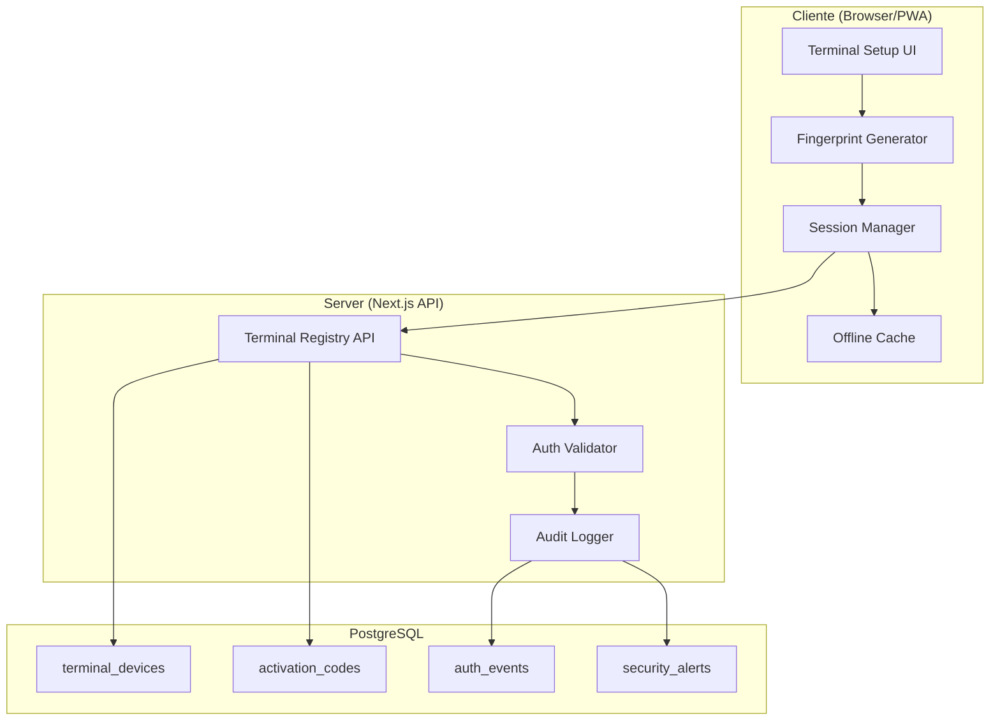
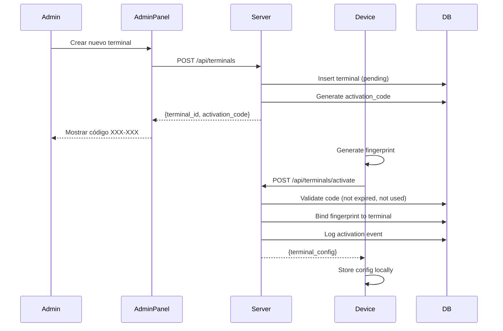

# Design Document: Terminal Architecture v2

## Overview

Esta mejora arquitectónica transforma el sistema de registro y autenticación de terminales de PARK POS de un modelo básico basado en localStorage a un sistema empresarial con device binding, códigos de activación, autenticación adaptativa, y validación server-side.

El diseño se basa en las mejores prácticas de la industria POS 2025-2026 (Square, Toast, Clover) y estándares de seguridad modernos (PCI DSS 4.x, Zero Trust).

**Principios de diseño:**
1. **Defense in Depth**: Múltiples capas de validación (client + server)
2. **Risk-Based Authentication**: Ajustar requisitos según contexto
3. **Offline-First**: Funcionar sin conexión con sync posterior
4. **Audit Everything**: Registro completo para compliance

## Architecture



### Flujo de Registro de Terminal



## Components and Interfaces

### 1. Enhanced Fingerprint Generator

```typescript
// src/core/auth/fingerprint-v2.ts

interface FingerprintSignals {
  // Hardware signals
  screen: string;           // resolution + colorDepth
  hardware: string;         // cores + memory + touchPoints
  platform: string;         // OS + architecture
  
  // Browser signals
  userAgent: string;
  language: string;
  timezone: string;
  
  // Canvas fingerprint
  canvas2d: string;
  webgl: string;
  webglVendor: string;
  
  // Audio fingerprint
  audioContext: string;
  
  // Font detection
  fonts: string;
  
  // Behavioral (optional)
  plugins: string;
}

interface FingerprintResult {
  hash: string;              // SHA-256 hash
  signals: FingerprintSignals;
  entropy: number;           // 0-100 quality score
  timestamp: string;
}

async function generateEnhancedFingerprint(): Promise<FingerprintResult>;
function calculateSimilarity(fp1: string, fp2: string): number; // 0-100
function hashWithSalt(fingerprint: string, salt: string): string;
```

### 2. Terminal Registry Service

```typescript
// src/core/auth/terminal-registry.ts

interface TerminalDevice {
  id: string;                    // UUID
  terminal_id: string;           // e.g., "CAJA_01"
  tenant_id: string;
  role: TerminalRole;
  fingerprint_hash: string;      // Salted hash
  fingerprint_salt: string;
  status: 'pending' | 'active' | 'disabled';
  bound_at: string | null;
  last_seen_at: string;
  last_fingerprint_check: string;
  drift_score: number;           // 0-100
  location_id: string;
  device_name: string;
}

interface ActivationCode {
  id: string;
  terminal_id: string;
  code: string;                  // 6 digits
  expires_at: string;
  attempts: number;
  used: boolean;
  created_by: string;
}

interface TerminalRegistryAPI {
  // Admin operations
  createTerminal(config: CreateTerminalInput): Promise<{terminal: TerminalDevice, code: ActivationCode}>;
  generateActivationCode(terminalId: string): Promise<ActivationCode>;
  disableTerminal(terminalId: string): Promise<void>;
  
  // Device operations
  activateDevice(code: string, fingerprint: FingerprintResult): Promise<TerminalDevice>;
  validateTerminal(terminalId: string, fingerprint: string): Promise<ValidationResult>;
  
  // Queries
  getTerminal(terminalId: string): Promise<TerminalDevice | null>;
  listTerminals(tenantId: string): Promise<TerminalDevice[]>;
}
```

### 3. Risk-Based Auth Validator

```typescript
// src/core/auth/risk-validator.ts

interface RiskFactors {
  fingerprintMatch: number;      // 0-100 similarity
  ipKnown: boolean;
  timeOfDay: 'business' | 'off-hours';
  failedAttempts: number;
  daysSinceLastAuth: number;
  deviceAge: number;             // days since binding
}

interface RiskAssessment {
  score: number;                 // 0-100
  factors: RiskFactors;
  requiredAuth: AuthRequirement;
  alerts: string[];
}

type AuthRequirement = 
  | 'pin_only'
  | 'pin_plus_manager'
  | 'activation_code_required'
  | 'blocked';

function calculateRiskScore(factors: RiskFactors): number;
function determineAuthRequirement(score: number, factors: RiskFactors): AuthRequirement;
```

### 4. Session Manager v2

```typescript
// src/core/auth/session-v2.ts

interface SecureSession {
  id: string;
  terminal_id: string;
  employee_id: string;
  employee_name: string;
  employee_role: EmployeeRole;
  terminal_role: TerminalRole;
  fingerprint_at_login: string;
  risk_score_at_login: number;
  created_at: string;
  last_activity_at: string;
  last_fingerprint_check: string;
  expires_at: string;
}

interface SessionManagerV2 {
  createSession(terminal: TerminalDevice, employee: Employee, riskScore: number): SecureSession;
  validateSession(): Promise<SessionValidation>;
  updateActivity(): void;
  periodicFingerprintCheck(): Promise<boolean>;
  invalidateOtherSessions(employeeId: string): Promise<void>;
  logout(): void;
}

interface SessionValidation {
  valid: boolean;
  reason?: 'expired' | 'inactive' | 'fingerprint_changed' | 'superseded';
  requiresReauth: boolean;
}
```

### 5. Audit Logger

```typescript
// src/core/auth/audit-logger.ts

type AuthEventType = 
  | 'terminal_created'
  | 'activation_code_generated'
  | 'device_activated'
  | 'login_success'
  | 'login_failed'
  | 'logout'
  | 'session_expired'
  | 'fingerprint_drift_detected'
  | 'step_up_auth_required'
  | 'terminal_disabled'
  | 'security_alert';

interface AuthEvent {
  id: string;
  tenant_id: string;
  terminal_id: string;
  employee_id: string | null;
  event_type: AuthEventType;
  risk_score: number | null;
  fingerprint_match: number | null;
  ip_address: string;
  user_agent: string;
  metadata: Record<string, unknown>;
  created_at: string;
}

interface SecurityAlert {
  id: string;
  tenant_id: string;
  terminal_id: string;
  alert_type: string;
  severity: 'low' | 'medium' | 'high' | 'critical';
  message: string;
  acknowledged: boolean;
  created_at: string;
}

interface AuditLogger {
  logAuthEvent(event: Omit<AuthEvent, 'id' | 'created_at'>): Promise<void>;
  createSecurityAlert(alert: Omit<SecurityAlert, 'id' | 'created_at'>): Promise<void>;
  queryEvents(filters: EventFilters): Promise<AuthEvent[]>;
  queryAlerts(filters: AlertFilters): Promise<SecurityAlert[]>;
}
```

### 6. Offline Auth Cache

```typescript
// src/core/auth/offline-cache.ts

interface CachedCredentials {
  terminal_id: string;
  fingerprint_hash: string;
  employee_pins: Map<string, string>;  // employee_id -> hashed PIN
  cached_at: string;
  expires_at: string;                   // 24 hours from cache
  integrity_hash: string;               // HMAC of all data
}

interface OfflineAuthCache {
  cacheCredentials(terminal: TerminalDevice, employees: Employee[]): Promise<void>;
  validateOffline(terminalId: string, employeeId: string, pin: string): Promise<boolean>;
  isExpired(): boolean;
  verifyIntegrity(): boolean;
  getPendingEvents(): AuthEvent[];
  syncPendingEvents(): Promise<void>;
  clear(): void;
}
```

## Data Models

### Database Schema (Prisma)

```prisma
model TerminalDevice {
  id                    String    @id @default(uuid())
  terminal_id           String    @unique
  tenant_id             String
  role                  String
  fingerprint_hash      String?
  fingerprint_salt      String
  status                String    @default("pending")
  bound_at              DateTime?
  last_seen_at          DateTime  @default(now())
  last_fingerprint_check DateTime @default(now())
  drift_score           Int       @default(0)
  location_id           String
  device_name           String
  created_at            DateTime  @default(now())
  updated_at            DateTime  @updatedAt
  
  activation_codes      ActivationCode[]
  auth_events          AuthEvent[]
  
  @@index([tenant_id])
  @@index([status])
}

model ActivationCode {
  id          String   @id @default(uuid())
  terminal_id String
  code        String
  expires_at  DateTime
  attempts    Int      @default(0)
  used        Boolean  @default(false)
  created_by  String
  created_at  DateTime @default(now())
  
  terminal    TerminalDevice @relation(fields: [terminal_id], references: [terminal_id])
  
  @@index([code])
  @@index([terminal_id])
}

model AuthEvent {
  id                String   @id @default(uuid())
  tenant_id         String
  terminal_id       String
  employee_id       String?
  event_type        String
  risk_score        Int?
  fingerprint_match Int?
  ip_address        String
  user_agent        String
  metadata          Json     @default("{}")
  created_at        DateTime @default(now())
  
  terminal          TerminalDevice @relation(fields: [terminal_id], references: [terminal_id])
  
  @@index([tenant_id, created_at])
  @@index([terminal_id])
  @@index([event_type])
}

model SecurityAlert {
  id           String   @id @default(uuid())
  tenant_id    String
  terminal_id  String
  alert_type   String
  severity     String
  message      String
  acknowledged Boolean  @default(false)
  created_at   DateTime @default(now())
  
  @@index([tenant_id, acknowledged])
  @@index([severity])
}
```

## Correctness Properties

*A property is a characteristic or behavior that should hold true across all valid executions of a system—essentially, a formal statement about what the system should do. Properties serve as the bridge between human-readable specifications and machine-verifiable correctness guarantees.*

### Property 1: Fingerprint Signal Completeness

*For any* device fingerprint generation, the resulting FingerprintResult SHALL contain data from at least 12 distinct signal sources, and the entropy score SHALL be greater than 0.

**Validates: Requirements 1.1**

### Property 2: Fingerprint Hash Determinism with Salt

*For any* raw fingerprint string and tenant-specific salt, hashing the same fingerprint with the same salt SHALL always produce the same hash, AND hashing the same fingerprint with different salts SHALL produce different hashes.

**Validates: Requirements 1.2**

### Property 3: Fingerprint Similarity Scoring

*For any* two fingerprints, the calculateSimilarity function SHALL return a value between 0 and 100 inclusive, where identical fingerprints return 100 and completely different fingerprints return values approaching 0.

**Validates: Requirements 1.3, 1.5**

### Property 4: Activation Code Format and Expiry

*For any* generated activation code, the code SHALL be exactly 6 digits, AND the expires_at timestamp SHALL be exactly 15 minutes after creation.

**Validates: Requirements 2.1**

### Property 5: Device Binding Exclusivity

*For any* device fingerprint that is bound to a terminal, attempting to bind the same fingerprint to a different terminal SHALL be rejected, AND the original binding SHALL remain unchanged.

**Validates: Requirements 2.2, 2.4**

### Property 6: Activation Code Expiry Enforcement

*For any* activation code, if the current time exceeds expires_at, the code SHALL be rejected regardless of whether it was previously valid.

**Validates: Requirements 2.3**

### Property 7: Server Terminal Validation

*For any* terminal authentication request, the server SHALL verify that the terminal_id exists in the database AND has status='active', rejecting requests for non-existent or disabled terminals.

**Validates: Requirements 3.1, 3.3**

### Property 8: Server Fingerprint Verification with Drift

*For any* event submission from a terminal, the server SHALL calculate fingerprint similarity, AND if similarity is below 50%, the request SHALL be rejected with a re-activation requirement.

**Validates: Requirements 3.2, 3.4**

### Property 9: Risk-Based Authentication Requirements

*For any* login attempt, the authentication requirements SHALL be determined by device state:
- Known device with fingerprint match ≥70%: PIN only
- Known device with fingerprint match 30-70%: PIN + manager confirmation
- Unknown/unbound device: Activation code + PIN + manager approval

**Validates: Requirements 4.1, 4.2, 4.3**

### Property 10: Risk Score Calculation Completeness

*For any* risk assessment, the calculated score SHALL incorporate all defined factors (fingerprint match, IP known, time of day, failed attempts), AND scores above 70 SHALL always require Step_Up_Auth.

**Validates: Requirements 4.4, 4.5**

### Property 11: Session Activity Tracking and Timeout

*For any* active session, user activity SHALL update the last_activity_at timestamp, AND sessions inactive for more than 15 minutes SHALL be automatically invalidated.

**Validates: Requirements 5.2, 5.3**

### Property 12: Periodic Session Fingerprint Validation

*For any* session that has been active for more than 5 minutes since the last fingerprint check, the system SHALL re-validate the fingerprint, AND if validation fails, the session SHALL require re-authentication.

**Validates: Requirements 5.4, 5.5**

### Property 13: Single Session Per Employee

*For any* employee, when a new session is created, all previous sessions for that employee SHALL be invalidated, ensuring only one active session exists at any time.

**Validates: Requirements 5.6**

### Property 14: Audit Log Completeness

*For any* authentication event (login, logout, failure, etc.), the audit log entry SHALL contain all required fields: timestamp, terminal_id, employee_id, result, risk_score, fingerprint_match.

**Validates: Requirements 6.1, 6.2**

### Property 15: Navigation Route Correctness

*For any* terminal selection, the system SHALL navigate to the correct role-specific route:
- CAJA_* → /pos
- MOZO_* → /mozo
- SPC_HORNO → /cocina/horno
- SPC_COCINA → /cocina
- SPC_BAR → /bar

**Validates: Requirements 7.2**

### Property 16: Offline Credential Caching

*For any* successful online authentication, the system SHALL cache credentials locally, AND offline authentication SHALL validate against the cached hash, producing the same result as online validation would.

**Validates: Requirements 8.1, 8.2**

### Property 17: Offline Cache Expiry and Sync

*For any* offline authentication events, when connection is restored, all pending events SHALL be synced to the server, AND if offline duration exceeds 24 hours, the cache SHALL be invalidated requiring online re-authentication.

**Validates: Requirements 8.3, 8.4**

### Property 18: Cache Tamper Detection

*For any* cached credentials, if the integrity_hash does not match the HMAC of the cached data, the cache SHALL be considered tampered and require full online re-authentication.

**Validates: Requirements 8.5**

## Error Handling

### Error Categories

| Category | HTTP Status | Client Action |
|----------|-------------|---------------|
| Invalid activation code | 400 | Show error, allow retry |
| Expired activation code | 410 | Request new code from admin |
| Terminal disabled | 403 | Contact admin |
| Fingerprint mismatch | 401 | Re-activate device |
| Session expired | 401 | Re-login |
| Rate limited | 429 | Wait and retry |
| Server error | 500 | Retry with backoff |

### Graceful Degradation

1. **Fingerprint generation fails**: Use reduced-entropy identifier, require Step_Up_Auth
2. **Server unreachable**: Use offline cache if available and not expired
3. **IndexedDB unavailable**: Fall back to sessionStorage (no offline support)

## Testing Strategy

### Unit Tests

- Fingerprint signal collection (mock browser APIs)
- Similarity calculation with known inputs
- Risk score calculation with various factor combinations
- Session timeout logic
- Activation code validation

### Property-Based Tests

Each correctness property will be implemented as a property-based test using fast-check:

```typescript
// Example: Property 3 - Fingerprint Similarity Scoring
import fc from 'fast-check';

describe('Fingerprint Similarity', () => {
  // Feature: terminal-architecture-v2, Property 3: Fingerprint Similarity Scoring
  it('should return values between 0 and 100 for any two fingerprints', () => {
    fc.assert(
      fc.property(
        fc.string({ minLength: 32, maxLength: 32 }),
        fc.string({ minLength: 32, maxLength: 32 }),
        (fp1, fp2) => {
          const similarity = calculateSimilarity(fp1, fp2);
          return similarity >= 0 && similarity <= 100;
        }
      ),
      { numRuns: 100 }
    );
  });
  
  it('should return 100 for identical fingerprints', () => {
    fc.assert(
      fc.property(
        fc.string({ minLength: 32, maxLength: 32 }),
        (fp) => calculateSimilarity(fp, fp) === 100
      ),
      { numRuns: 100 }
    );
  });
});
```

### Integration Tests

- Full activation flow (admin creates terminal → device activates)
- Login flow with various risk levels
- Session lifecycle (create → activity → timeout)
- Offline → online sync

### E2E Tests (Playwright)

- Terminal setup UI flow
- Login with PIN
- Step-up auth when required
- Admin panel terminal management
